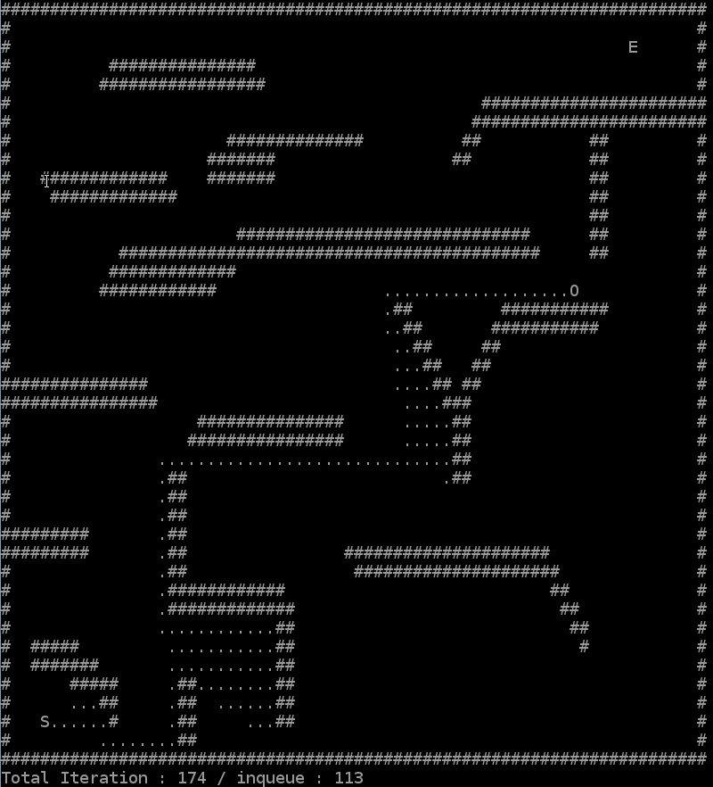
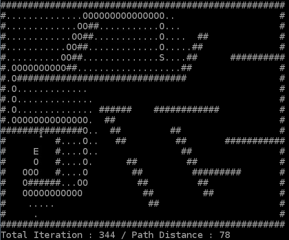
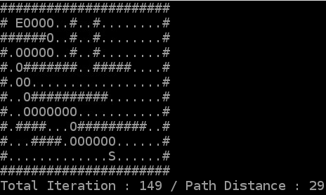
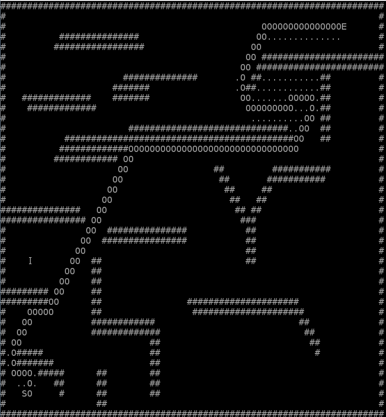
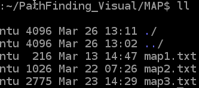

 # PathFinding_Visual

 ## 1. What is "PathFinding Visual"
 This program provides a visual representation of three algorithms that solve "PathFinding" problems.

Each algorithm is:
1. Dijkstra Algorithm
2. A_Star Algorithm
3. DFS (+ Huristic)

The execution screen is shown below.

 
 ## 2. How to Run 
2-0. Setting and MakeFile
The Linux environment and the C++ compiler are required to run this program. (If you are not in a Linux environment, you will need to change the corresponding function by referring to linuxfunc.cpp. Sorry....) If the GNU C++ compiler is not installed in the linux environment, please run the code below.

    sudo apt-get install g++
    
Once the installation is complete, you will now enter the make keyword and the a.out file will be created. 

In the process of creating a.out file, there will have been unnecessary files such as visual.o. Please enter the code below if you want to sort this out.

    make clean

At last, write down the code below and run the program.

    ./a.out
    
2-1. Select the algorithm number to run first.

2-2. And determine the rate at which the execution screen of the algorithm will be displayed. The number entered at this time is in microseconds It is recommended that you enter 50000 on the first run.

2-3. Select the map to run the algorithm. There are three types of prepared maps, and you can add them in the future.

 ## 3. Execute A_Star Algorithm
If you run algorithm number 2, you must select the Huristic function of the A_Star algorithm to use.

Evaluation function of the A_Star function: 
    
    f(n)=g(n)+h(n) (f(n) : Evaluate Function, g(n) : Path Cost, h(n) : heuristic function)

There are two functions prepared.
1. Manhattan_Distance
2. Real Distance

Select the heuristic function to use, then enter the weight of the heuristic function. We recommend a value between 1 and 3 at the beginning. (If the weight is zero, the function will work just like Dijkstra Algorithm.)

The A_Star algorithm may not find the optimal path. Instead, the A_Star algorithm finds the appropriate path in a faster time.

 ## 4. Dijkstra Algorithm
The Dijkstra Algorithm searches for the shortest possible path. When the function ends, it outputs the shortest path distance.
 

 ## 5. DFS Algorithm
This DFS algorithm is a simple addition of the Heuristic technique to DFS.
For each search, first navigate in the direction closest to the target point.
(Surprisingly, in most cases, this function was the fastest.)

 ## 6. How to add a Map
First, enter the MAP Directory. Then add the map according to how to name it.

Formats : map(num).txt

The rules for map00.txt are as follows:

6-1. The first start line is given the map size.

6-2. Meaning of each number : 

0 : Free space to pass, 1 : Walls that cannot passable, 2 : Starting point, 3 : Destination point
 
If there are errors such as multiple start points, Destination points, or incorrect map size, the program may not function normally.
